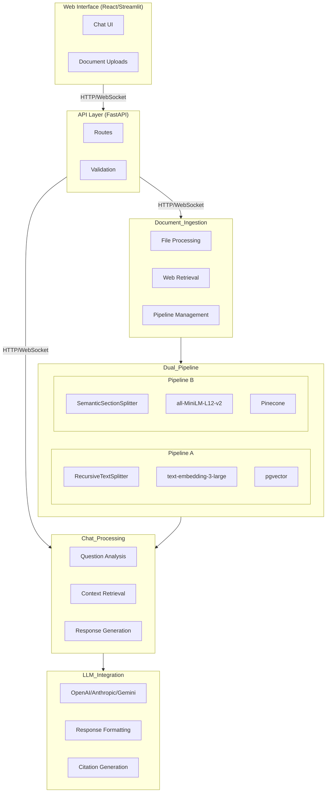

# diagnostics-chatbot

### Todos
1. Add logic to handle multple users (use chat threads with unique IDs)
2. Link documents to threads/users (currently all documents and their chunks can be accessed all the time)
3. Improve error handling
4. Write tests

### Architecture Overview

### Subtask Breakdown

#### 1. Core Infrastructure Setup
- [ ] Set up FastAPI application skeleton with proper routing
- [ ] Configure Pydantic models for:
  - Document upload requests
  - Chat messages

#### 2. Document Ingestion System
- [ ] Implement file upload handler (PDF/DOCX parsing)
- [ ] Design web retrieval automation:
  - Manufacturer/model detection from chat context
  - Web search integration (SerpAPI/Google Search API)
  - PDF/HTML download and extraction
- [ ] Create document preprocessing utilities

#### 3. Dual Pipeline Implementation
- [ ] Pipeline A:
  - RecursiveTextSplitter configuration (optimal chunk size/overlap)
  - text-embedding-3-large integration
  - pgvector database setup and CRUD operations
- [ ] Pipeline B:
  - SemanticSectionSplitter implementation
  - all-MiniLM-L12-v2 embedding model
  - Pinecone integration
- [ ] Pipeline selection/routing logic

#### 4. Chat Processing System
- [ ] Question analysis module:
  - Intent detection
  - Entity extraction (for troubleshooting context)
- [ ] Context retrieval:
  - Hybrid search strategy
  - Pipeline selection logic
- [ ] Response generation:
  - LLM API integration (OpenAI/Anthropic/Gemini)
  - Citation formatting (doc name + page/URL)

#### 5. Web Interface
- [ ] Choose and implement UI framework (React/Streamlit/Gradio)
- [ ] Design chat interface components
- [ ] Implement document upload UI
- [ ] Set up WebSocket/REST API communication

#### 6. Deployment & Documentation
- [ ] Dockerize application
- [ ] Create docker-compose.yml with all dependencies
- [ ] Write comprehensive README.md
- [ ] Create architecture diagram
- [ ] Document pipeline configurations and rationale

#### Extras (to be done later)
- [ ] Implement basic auth/rate limiting
- [ ] Set up logging and monitoring