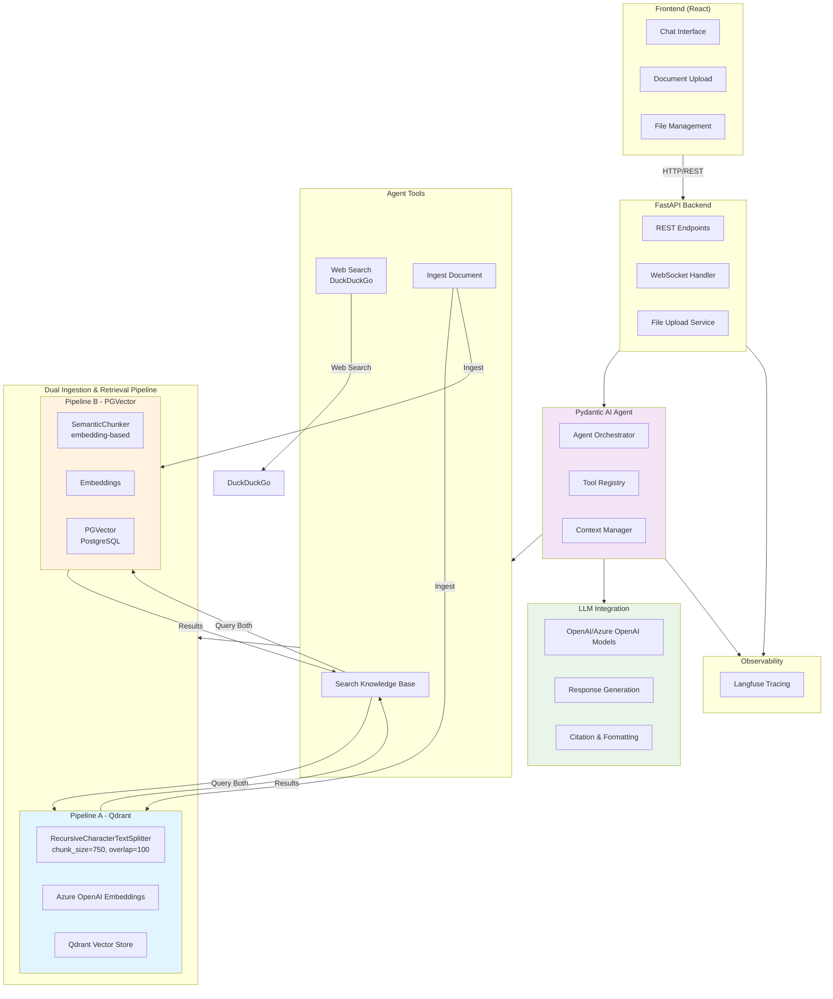

# diagnostics-chatbot
## How to run
1. Create an `.env` file from the example env file:
```sh
cp .env.example .env
```
2. Plug in the needed values in the `.env` file (API keys, models, etc)

3. Start the docker compose:
```sh
docker compose up --build

# or use the bash script: `bash compose_up.sh`

```
4. The chat web ui will be available at http://localhost:3000/


### Todos
1. Add logic to handle multple users (use chat threads with unique IDs)
2. Link documents to threads/users (currently all documents and their chunks can be accessed all the time)
3. Improve error handling
4. Write tests


### Architecture Overview


