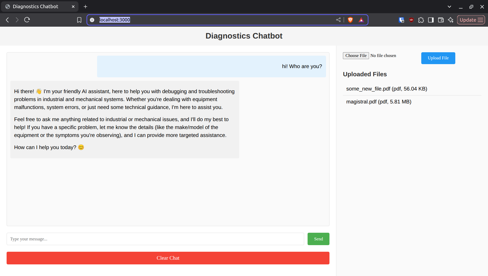
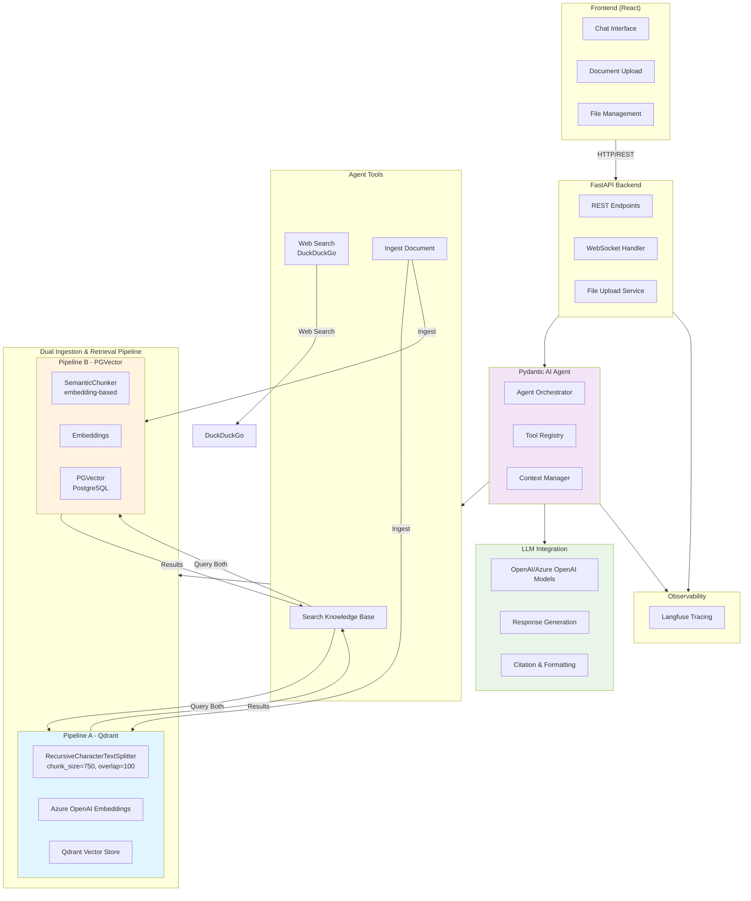

# diagnostics-chatbot
## How to run
1. Create an `.env` file from the example env file:
```sh
cp .env.example .env
```
2. Plug in the needed values in the `.env` file (API keys, models, etc)

3. Start the docker compose:
```sh
docker compose up --build

# or use the bash script: `bash compose_up.sh`

```
4. The chat web ui will be available at http://localhost:3000/



## Architecture Overview




:::thinking
Okay, let's see. The user wants me to rewrite the given section into three points: Pipeline A, Pipeline B, and Retrieval Logic. The original text is a bit scattered, so I need to organize it properly.

First, I'll start with Pipeline A. The original mentions the text splitter, embedding model, and vector DB. The text splitter is Recursive Character, which is straightforward. The embedding is OpenAI's text-embedding-3-large with 3072 dimensions and 8k tokens. The vector DB is Qdrant self-hosted. I should present these in a clear, concise manner under Pipeline A.

Next, Pipeline B. The text splitter here is Semantic Text Splitting, which is more advanced but slower. The embedding model is E5-Mistral-7B-Instruct on SambaNova. The vector DB is PGVector, an extension of Postgres. I need to highlight the differences from Pipeline A, like the more sophisticated splitter and the different embedding model and DB.

Then, the Retrieval Logic section. The original says they tried letting the agent choose but it didn't work due to document tracking issues. I should explain that they merged the pipelines instead, using both for retrieval without requiring the agent to decide. Mention the challenges of maintaining document-pipeline mappings and the solution of combining both pipelines' outputs.

I need to make sure each section is clearly labeled and the information flows logically. Avoid technical jargon where possible, but keep the necessary terms. Check for any missing details from the original and ensure all points are covered. Also, use bullet points or subheadings as in the example to make it easy to read.

## Pipeline Design

#### **Pipeline A**
- **Text Splitting**: Uses **Recursive Character Text Splitter** for general-purpose,structure-agnostic document processing. It is efficient and computationally lightweight.
- **Embedding Model**: **OpenAI's `text-embedding-3-large`** (3072 dimensions, 8k-token capacity), a widely adopted industry standard for high-quality embeddings.
- **Vector Database**: **Self-hosted Qdrant** (via Docker Compose), a scalable and popular vector DB used by the biggest providers such as OpenAI.

---

#### **Pipeline B**  
- **Text Splitting**: Employs **Semantic Text Splitting** for context-aware chunking. This method minimzes semantic overlap but is slower and more resource-intensive.
- **Embedding Model**: **`E5-Mistral-7B-Instruct`** on SambaNova, an open-weight model known for strong performance in semantic tasks.
- **Vector Database**: **PGVector** (PostgreSQL extension), chosen for seamless integration with existing backend systems and relational data workflows.

---

#### **Retrieval Logic**
- **Merged Retrieval Strategy**: Instead of allowing the agent to dynamically select a pipeline, both pipelines are used in parallel for retrieval. This avoids the complexity of tracking which pipeline was used for each document.
- **Challenges Addressed**:
  - Maintaining a mapping of documents to their ingestion pipeline proved impractical for a time-constrained prototype.  
  - Combining results from both pipelines ensures robustness without requiring explicit pipeline selection logic.
- **Implementation**: Query results from both Qdrant and PGVector are aggregated, leveraging the strengths of each pipeline (e.g., semantic precision from Pipeline B and robustness from Pipeline A).

## Todos
1. Add logic to handle multple users (use chat threads with unique IDs)
2. Link documents to threads/users (currently all documents and their chunks can be accessed all the time)
3. Improve error handling
4. Write tests
5. Incorporate lexical and hybrid search (e.g. BM25)